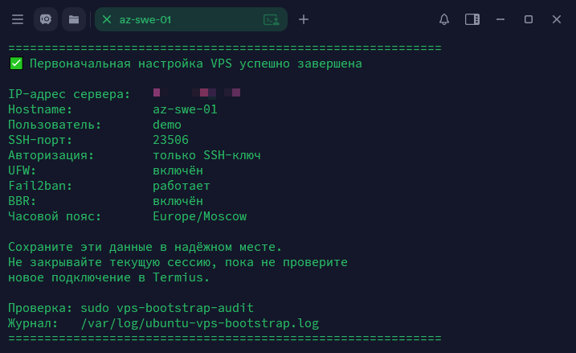

# 🚀 Ubuntu VPS Bootstrap

Скрипт базовой настройки сервера на Ubuntu.

### Установка

```bash
curl -fsSL \
-o bootstrap.sh \
https://raw.githubusercontent.com/NaitSide/Ubuntu-vps-bootstrap/main/bootstrap.sh \
&& bash bootstrap.sh
```



### SSH

| Параметр | Описание |
|---|---|
| `Port <порт>` | Устанавливает выбранный порт SSH. |
| `PasswordAuthentication no` | Отключает вход по паролю. |
| `PermitRootLogin no` | Отключает вход по SSH под пользователем `root`. |
| `PubkeyAuthentication yes` | Разрешает вход по SSH-ключу. |
| `AuthenticationMethods publickey` | Разрешает только вход по SSH-ключу. |
| `KbdInteractiveAuthentication no` | Отключает вход через интерактивные запросы пароля или кода подтверждения. |
| `ChallengeResponseAuthentication no` | Устаревшее название `KbdInteractiveAuthentication`. Также отключает этот способ входа. |
| `PermitEmptyPasswords no` | Запрещает вход с пустым паролем. |
| `HostbasedAuthentication no` | Отключает вход на основе доверия к другому компьютеру. |
| `GSSAPIAuthentication no` | Отключает вход через GSSAPI, например Kerberos. |

Подробнее о параметрах — в [справке OpenSSH для Ubuntu](https://manpages.ubuntu.com/manpages/noble/man5/sshd_config.5.html).

### Пакеты

| Пакет | Описание |
|---|---|
| `openssh-server` | Обновляет OpenSSH. Если его нет, устанавливает и позволяет подключаться к серверу по SSH. |
| `ufw` | Управляет firewall: разрешает или запрещает сетевые подключения. |
| `fail2ban` | Временно блокирует IP-адреса после повторяющихся неудачных попыток входа по SSH. |
| `iproute2` | Содержит команды `ip` и `ss` для работы с сетью и просмотра открытых портов. |
| `sudo` | Позволяет администратору выполнять команды с правами `root`. |

### Пользователи и SSH-ключи

| Команда, параметр или файл | Описание |
|---|---|
| `useradd -m -s /bin/bash <пользователь>` | Создаёт пользователя. |
| `usermod -s /bin/bash <пользователь>` | Устанавливает Bash как командную оболочку пользователя. |
| `usermod -aG sudo <пользователь>` | Добавляет пользователя в группу администраторов `sudo`. |
| `passwd -l <пользователь>` | Блокирует пароль пользователя. Вход по SSH-ключу остаётся доступен. |
| `<пользователь> ALL=(ALL) NOPASSWD:ALL` | Разрешает пользователю выполнять команды через `sudo` без запроса пароля. |
| `.ssh/authorized_keys` | Сохраняет введённый открытый SSH-ключ в домашнем каталоге пользователя. |
| `.ssh`: `0700`; `.ssh/authorized_keys`: `0600` | Задаёт правильные права доступа для каталога `.ssh` и файла с SSH-ключами `authorized_keys`. |

### Hostname

| Команда | Описание |
|---|---|
| `hostnamectl --static --transient set-hostname <hostname>` | Задаёт hostname сервера. |

### UFW

UFW — брандмауэр, который управляет сетевыми подключениями.

| Команда | Описание |
|---|---|
| `ufw default deny incoming` | Запрещает входящие подключения, для которых нет разрешающего правила. |
| `ufw default allow outgoing` | Разрешает исходящие подключения по умолчанию. |
| `ufw allow <порт>/tcp` | Открывает выбранный SSH-порт. |
| `ufw --force enable` | Включает firewall. |
| `ufw --force delete allow OpenSSH` | Удаляет стандартное разрешающее правило профиля OpenSSH. |
| `ufw --force delete allow 22/tcp` | Удаляет разрешающее правило для стандартного SSH-порта `22`. |
| `ufw --force delete allow <старый_порт>/tcp` | При смене порта удаляет правило для прежнего SSH-порта Bootstrap. |
| `ufw --force reload` | Применяет обновлённые правила firewall. |

### Fail2ban

| Параметр или команда | Описание |
|---|---|
| `enabled = true` | Включает защиту SSH от повторяющихся неудачных попыток входа. |
| `port = <порт>` | Привязывает блокировки к выбранному SSH-порту. |
| `systemctl enable fail2ban` | Включает запуск Fail2ban при загрузке сервера. |
| `systemctl restart fail2ban` | Перезапускает Fail2ban с новыми настройками. |

### BBR и часовой пояс

[BBR](https://github.com/google/bbr) — алгоритм от Google, который оптимизирует передачу TCP-трафика.

| Параметр или команда | Описание |
|---|---|
| `net.ipv4.tcp_congestion_control=bbr` | Выбирает BBR — алгоритм управления скоростью передачи данных TCP. |
| `net.core.default_qdisc=fq` | Выбирает очередь `fq`, которая распределяет исходящий трафик между потоками. |
| `modprobe tcp_bbr` | Загружает модуль BBR. |
| `sysctl -p /etc/sysctl.d/99-ubuntu-vps-bootstrap.conf` | Применяет сохранённые настройки BBR и очереди `fq`. |
| `timedatectl set-timezone <часовой_пояс>` | Устанавливает выбранный часовой пояс. По умолчанию — `Europe/Moscow`. |

## Этапы выполнения

На экране отображаются только основные этапы без лишнего вывода пакетного
менеджера и системных служб:

```text
[1/7] Проверка системы
[2/7] Настройка hostname
[3/7] Создание пользователя и установка SSH-ключа
[4/7] Установка системных пакетов
[5/7] Настройка SSH
[6/7] Настройка UFW, Fail2ban, BBR и часового пояса
[7/7] Финальная проверка
```

Полный технический вывод сохраняется в журнале установки. При ошибке
Bootstrap останавливается. Если ошибка произошла при применении SSH, UFW
или Fail2ban, скрипт пытается восстановить резервную копию этого этапа.

## Выбор часового пояса

Для Москвы достаточно нажать Enter при запросе:

```text
Введите часовой пояс [Europe/Moscow]:
```

Для Беларуси можно указать:

```text
Europe/Minsk
```

Посмотреть доступные зоны непосредственно на сервере:

```bash
timedatectl list-timezones
```

Для удобного просмотра по страницам:

```bash
timedatectl list-timezones | less
```

Названия берутся из [официальной базы часовых поясов IANA](https://www.iana.org/time-zones).
Также доступна [таблица идентификаторов часовых поясов](https://en.wikipedia.org/wiki/List_of_tz_database_time_zones).

## Защита от потери доступа

Bootstrap применяет изменения в безопасной последовательности:

1. Проверяет hostname, пользователя, SSH-ключ, порт и часовой пояс.
2. Создаёт пользователя и устанавливает проверенный открытый ключ.
3. Проверяет конфигурацию SSH до перезапуска службы.
4. Открывает новый SSH-порт в UFW до переключения SSH.
5. Перезапускает SSH и проверяет фактически слушающий порт.
6. Проверяет вход только по ключу, состояние UFW и Fail2ban.
7. При ошибке на этапе применения SSH, UFW и Fail2ban пытается восстановить их резервную копию.

Даже после успешной установки не закрывайте исходную сессию сразу. Сначала
создайте в Termius новое подключение с указанными пользователем и портом и
убедитесь, что SSH-ключ работает.

## Финальный отчёт

После успешной проверки Bootstrap выводит блок, данные из которого нужно
сохранить:

```text
============================================================
✅ Первоначальная настройка VPS успешно завершена

IP-адрес сервера:   203.0.113.10
Hostname:           vpn-hel-01
Пользователь:       demo
SSH-порт:           28473
Авторизация:        только SSH-ключ
UFW:                включён
Fail2ban:           работает
BBR:                включён
Часовой пояс:       Europe/Moscow

Сохраните эти данные в надёжном месте.
Не закрывайте текущую сессию, пока не проверите
новое подключение в Termius.
============================================================

```

Если адрес невозможно определить из текущего SSH-подключения, в отчёте будет
указано, что его нужно посмотреть в панели хостинг-провайдера.

## Проверка после установки

Краткий аудит:

```bash
sudo vps-bootstrap-audit
```

Подробный технический отчёт:

```bash
sudo vps-bootstrap-audit --details
```

После проверки нового SSH-подключения рекомендуется перезагрузить VPS и повторно
запустить краткий аудит.
